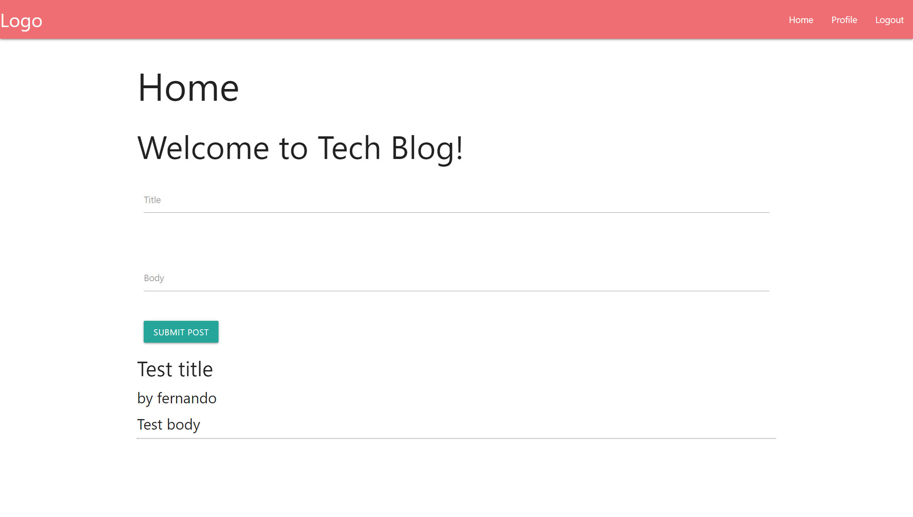

# Tech Blog

## Description
CMS-style blog site similar to a Wordpress site, where developers can publish their blog posts and comment on other developers’ posts as well.

## Tablet of Contents
- [Installation](#installation)
- [Usage](#usage)
- [License](#license)
- [How to Contribute](#how-to-contribute)
- [Tests](#tests)
- [Questions](#questions)
- [Deployed Link](#deployed-link)

## Installation
Copy the code base, do an NPM I, and create your own .env file and run nodemon.

## Usage
na

## License
MIT License

## How to Contribute
na

## Tests
na

## Questions
* Follow me on [GitHub](https://github.com/favalo06)
* Ask me questions at fernando.avalostorres91@gmail.com

## Deployed Link
https://limitless-lowlands-44580.herokuapp.com/ 